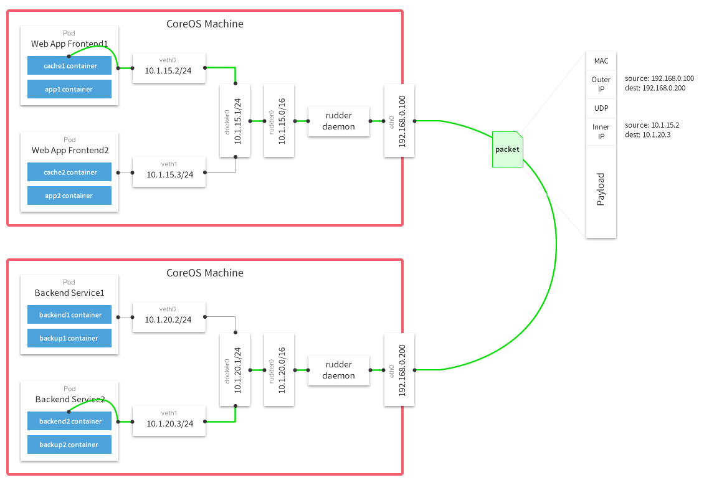

# flannel

flannel is a virtual network that gives a subnet to each host for use with container runtimes.

Platforms like Kubernetes assume that each container (pod) has a unique, routable IP inside the cluster.
The advantage of this model is that it reduces the complexity of doing port mapping.

## Theory of Operation

flannel runs an agent, flanneld, on each host and is responsible for allocating a subnet lease out of a preconfigured address space.
flannel uses [etcd](https://github.com/coreos/etcd) to store the network configuration, allocated subnets, and auxiliary data (such as host's IP).
The forwarding of packets is achieved using one of several strategies that are known as backends.
The simplest backend is `udp` and uses a TUN device to encapsulate every IP fragment in a UDP packet, forming an overlay network.
The following diagram demonstrates the path a packet takes as it traverses the overlay network:

## Documenation
- [Running](Documentation/running.md)
- [Configuration](Documentation/configuration.md)
- [Backends](Documentation/backends.md)
- [Troubleshooting](Documentation/troubleshooting.md)
- [Building (and releasing)](Documentation/building.md)
- [Projects integrating with flannel](Documentation/integrations.md)
- [Production users](Documentation/production-users.md)
